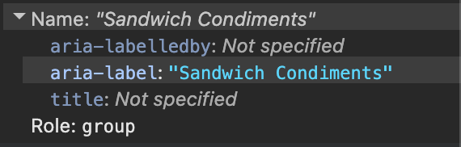
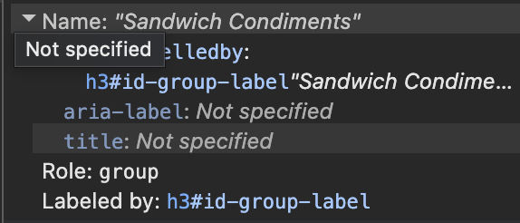

# Manual tests Checkbox

---
### Testing environment

MacOS: 26.5.1
Assistive technology: Voice Over Version 10 (993)

| Browser | Version                                 |
| ------- | --------------------------------------- |
| Chrome  | 148.0.7778.216 (Official Build) (arm64) |
| Firefox | 151.0.2 (aarch64)                       |
| Safari  | 26.5 (21624.2.5.11.4)                   |

---


| ID      | Manual test                       | Chrome + VO                               | Firefox + VO                       | Safari + VO                       | Observations                                                 |
| ------- | --------------------------------- | ----------------------------------------- | ---------------------------------- | --------------------------------- | ------------------------------------------------------------ |
| CBX-M01 | Navigate into checkbox group      | Pass                                      | Pass                               | Pass                              | Slight differences in wording is noted. See output below.    |
| CBX-M02 | Focus each checkbox               | Pass<br>"Tomato unticked Tick box, group" | Pass<br>"Tomato unticked checkbox" | Pass<br>"Tomato unticked tickbox" | Checkbox name, role and current state are announced          |
| CBX-M03 | Press Tab through checkboxes      | Pass                                      | Pass                               | Pass                              | Focus moves through checkboxes in expected order             |
| CBX-M04 | Press Space on unchecked checkbox | Pass<br>"ticked Tomato Tick box, group"   | Pass<br>"ticked Tomato checkbox"   | Pass<br>"ticked Tomato tickbox"   | Checkbox becomes checked and changed state is communicated   |
| CBX-M05 | Press Space again                 | Pass<br>"unticked Tomato Tick box, group" | Pass<br>"unticked Tomato checkbox" | Pass<br>"unticked Tomato tickbox" | Checkbox becomes unchecked and changed state is communicated |
| CBX-M06 | Keyboard focus on checkbox        | Pass                                      | Pass                               | Pass                              | Visible focus indicator is present                           |


CBX-M01:
Chrome: "Lettuce unticked Tick box, group Sandwich Condiments group"
Safari:     "Lettuce unticked tickbox Sandwich Condiments group"
Firefox:   "Lettuce unticked checkbox Sandwich Condiments group"


---
## Using ElementInternals - Exploratory Test
---
### Role and ARIA label on host
Using ElementInternals to communicate role and ARIA Label
```JS
	this._internals.role = 'group';
	this._internals.ariaLabel = this.groupLabel;
```

| Browser      | Announcement on group       |
| ------------ | --------------------------- |
| Chrome + VO  | "Sandwich Condiments group" |
| Firefox + VO | "Sandwich Condiments group" |
| Safari + VO  | "Sandwich Condiments group" |



Example from Chrome

**Notes**
- Consistent results across tested browsers
- Does not add the `role` or `aria-label` attributes to the elements
- Playwright's `getByRole` does not identify host as a group

---
### Using labelled by element in the host's Shadow DOM:
A second implementation test using the heading in the hosts Shadow DOM as a label
```JS
	const header = this.shadowRoot.getElementById('id-group-label');
	this._internals.ariaLabelledByElements = [header];
```

| Browser      | Announcement on group       |
| ------------ | --------------------------- |
| Chrome + VO  | "Sandwich Condiments group" |
| Firefox + VO | "Sandwich Condiments group" |
| Safari + VO  | No group announcement       |



Example from Chrome

**Notes**
- This is reaching in to a child DOM, and according to the documentation it should be outside of reflected-elements reference scope https://developer.mozilla.org/en-US/docs/Web/API/Document_Object_Model/Reflected_attributes#reflected_element_reference_scope
- Inconsistent behaviour

---
### Playwright Problems

- Playwright could not identify the group through its role, and did not identify the component as a group when it was communicated through ElementInternals
- Related Playwright issue [https://github.com/microsoft/playwright/issues/34264](https://github.com/microsoft/playwright/issues/34264)
- The final checkbox implementation exposes ARIA semantics directly on the host element, this also allows the semantics to be tested with Playwright's role based queries.
